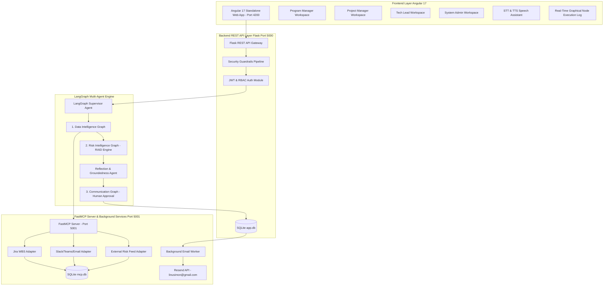
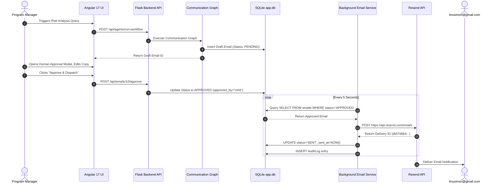

# System Architecture & Multi-Agent Component Diagrams

## High-Level System Architecture Diagram

```mermaid
graph TB
    subgraph Frontend Layer Angular 17
        UI[Angular 17 Standalone Web App - Port 4200]
        PM_Tab[Program Manager Workspace]
        Proj_Tab[Project Manager Workspace]
        Tech_Tab[Tech Lead Workspace]
        Admin_Tab[System Admin Workspace]
        STT_TTS[STT & TTS Speech Assistant]
        Graph_Trace[Real-Time Graphical Node Execution Log]
    end

    subgraph Backend REST API Layer Flask Port 5000
        API[Flask REST API Gateway]
        Auth[JWT & RBAC Auth Module]
        Guard[Security Guardrails Pipeline]
        DB[(SQLite app.db)]
    end

    subgraph LangGraph Multi-Agent Engine
        Super[LangGraph Supervisor Agent]
        G1[1. Data Intelligence Graph]
        G2[2. Risk Intelligence Graph - RAID Engine]
        G3[3. Communication Graph - Human Approval]
        Reflect[Reflection & Groundedness Agent]
    end

    subgraph FastMCP Server & Background Services Port 5001
        MCP[FastMCP Server - Port 5001]
        Jira_Adapt[Jira WBS Adapter]
        Comm_Adapt[Slack/Teams/Email Adapter]
        Risk_Adapt[External Risk Feed Adapter]
        MCP_DB[(SQLite mcp.db)]
        Poller[Background Email Worker]
        Resend[Resend API - linusimon@gmail.com]
    end

    UI --> API
    API --> Guard
    Guard --> Auth
    Auth --> Super
    Super --> G1
    G1 --> G2
    G2 --> Reflect
    Reflect --> G3
    G3 --> DB
    G1 --> MCP
    MCP --> Jira_Adapt
    MCP --> Comm_Adapt
    MCP --> Risk_Adapt
    Jira_Adapt --> MCP_DB
    Comm_Adapt --> MCP_DB
    Risk_Adapt --> MCP_DB
    DB --> Poller
    Poller --> Resend
```

---

## Human Approval & Email Dispatch Sequence Diagram

```mermaid
sequenceDiagram
    autonumber
    actor User as Program Manager
    participant UI as Angular 17 UI
    participant API as Flask Backend API
    participant Graph as Communication Graph
    participant DB as SQLite app.db
    participant Worker as Background Email Service
    participant Resend as Resend API
    actor Target as linusimon@gmail.com

    User->>UI: Triggers Risk Analysis Query
    UI->>API: POST /api/agents/run-workflow
    API->>Graph: Execute Communication Graph
    Graph->>DB: Insert Draft Email (Status: PENDING)
    Graph-->>UI: Return Draft Email ID #10
    User->>UI: Opens Human Approval Modal, Edits Copy
    User->>UI: Clicks "Approve & Dispatch"
    UI->>API: POST /api/emails/10/approve
    API->>DB: Update Status to APPROVED (approved_by="rohit")
    loop Every 5 Seconds
        Worker->>DB: Query SELECT FROM emails WHERE status='APPROVED'
        DB-->>Worker: Return Approved Email #10
        Worker->>Resend: POST https://api.resend.com/emails
        Resend-->>Worker: Return Delivery ID (db57d0b4...)
        Worker->>DB: UPDATE status='SENT', sent_at=NOW()
        Worker->>DB: INSERT AuditLog entry
    end
    Resend->>Target: Deliver Email Notification
```
